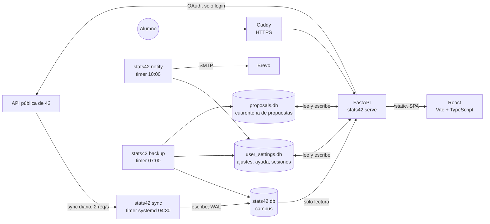

# 42 Stats

Web de estadísticas y ayuda entre alumnos para el campus **42 Madrid** (campus 22, 42cursus id 21), construida sobre la API pública de 42.
Entras con tu cuenta de 42 y ves **cómo vas frente a tu promoción** (ritmo, milestones, actividad, señales de atasco y consejos), **estadísticas
del campus** y una sección de **ayuda entre alumnos** (recursos, mentores que ya validaron cada proyecto, peticiones y puntos de mentoría).

En producción: <https://42madrid.zelada.es>. Por qué existe, con datos reales de cursus cerrados sin graduarse: [docs/POC.md](docs/POC.md).

## Índice

1. [Qué hace](#qué-hace)
2. [Arquitectura](#arquitectura)
3. [Datos y reglas de cálculo](#datos-y-reglas-de-cálculo)
4. [Ayuda entre alumnos](#ayuda-entre-alumnos)
5. [Seguridad](#seguridad)
6. [Privacidad y retención de datos](#privacidad-y-retención-de-datos)
7. [Rutas de la API](#rutas-de-la-api)
8. [Configuración](#configuración)
9. [Estructura del repositorio](#estructura-del-repositorio)
10. [Desarrollo local](#desarrollo-local)
11. [Pruebas](#pruebas)
12. [Despliegue y operación](#despliegue-y-operación)
13. [Avisos por correo con Brevo](#avisos-por-correo-con-brevo)
14. [Límites conocidos y hoja de ruta](#límites-conocidos-y-hoja-de-ruta)

---

## Qué hace

**Todo requiere iniciar sesión con 42** (no hay nada público salvo la portada de acceso). La web tiene cuatro páginas; la cabecera es solo el nombre y
un menú de tres rayas con las páginas, las secciones de la página actual, el tema (auto, claro, oscuro) y Salir.

| Página | Para qué sirve |
|---|---|
| `/login` | Portada de acceso: explica qué se verá, qué se usa (solo el perfil público) y qué se guarda |
| `/me` **Mi panel** | Tu situación: estado general, nivel, rank, horas, señales (actividad, milestones, evaluaciones…), consejos por reglas, tu línea de milestones, tu nivel frente a tu cursus, tu actividad semanal, proyectos en curso con su contexto, y un formulario para indicar a mano tu deadline y tu freeze. Aquí puedes **borrar todos tus datos** |
| `/ayuda` **Ayuda entre alumnos** | Recursos de estudio, mentoría, peticiones de otros, pedir ayuda, avisos por correo y, para administradores, moderación |
| `/campus` **Estadísticas del campus** | Resumen, niveles, altas, blackholes, promociones, ritmo por milestone, hábitos de los más rápidos, asistencia (mapa de calor y mapa de puestos), proyectos por cursus, evaluaciones y eventos |

Todos los datos del campus son **agregados**: no se muestra ninguna persona. El detalle individual solo lo ve el propio alumno.

## Arquitectura



- **Tres bases SQLite**, cada una con un único escritor: `stats42.db` (datos del campus, la escribe la sincronización; la web la abre en solo lectura),
  `user_settings.db` (lo que escriben los alumnos: ajustes, ayuda, sesiones, accesos; la escribe la web) y `proposals.db` (la cuarentena: solo lo que se propone
  por el formulario de recursos, que cualquier alumno puede enviar). Así no compiten por el bloqueo y un fallo en ese formulario no puede alcanzar sesiones ni correos. WAL activado.
- **Dos aplicaciones de 42 distintas:** la de la sincronización (`.env`) y la del login de la web (`.env.web`). 42 limita cada aplicación a 2 peticiones
  por segundo, y si se filtrara el secreto de la web, no daría acceso a la sincronización.
- **Backend:** FastAPI + SQLAlchemy 2 + pydantic, `httpx`, `typer` para la línea de comandos, `itsdangerous` para cookies firmadas.
- **Interfaz:** React 19 + Vite + TypeScript, compilada a estáticos que sirve el propio FastAPI. Una sola página HTML para todas las rutas. Queda una interfaz
  clásica (HTML y JS a mano) como reserva.
- **Producción:** Docker en una VM, detrás de Caddy (HTTPS), sin publicar puertos. Tres timers de systemd (sincronización, copia de seguridad y resumen diario).

## Datos y reglas de cálculo

### Qué se sincroniza

`stats42 sync` trae, de forma **incremental y reanudable** (marca de agua más punto de control por página, un día de solape), estos recursos:
alumnos, cursus de cada alumno, proyectos, intentos de proyecto, eventos, exámenes, quests y quests de alumnos (los milestones), evaluaciones y sesiones
de ordenador. La primera carga puede tardar horas por el límite de la API (2 peticiones por segundo y 1.200 por hora); si se corta, se repite el comando.
`stats42 audit` compara la base con lo que la API sirve realmente (no con `X-Total`, que sobreestima) para comprobar que no falta nada.

### Definiciones (las usa todo el producto)

| Concepto | Regla |
|---|---|
| **Intento terminado** | Estado `finished`, o con resultado (`validated` no nulo) aunque el estado sea otro |
| **Cheating** | Los intentos con nota −42 se excluyen siempre |
| **Notas válidas** | Solo entre 0 y 125 en las medias (la API contiene notas corruptas) |
| **Cursus de un intento** | El del intento (`project_users.cursus_ids`), no el del catálogo de proyectos, que incluye otros campus |
| **Alumno** | Cuenta con `kind = student`; las de staff (`admin`) y las externas nunca cuentan, aunque tengan registro en el 42cursus |
| **Activo** | Cursus abierto (sin fecha de cierre, o con cierre futuro) y no graduado |
| **Graduado** | Marcado como *alumni* por la API (`alumni?`) y con registro en el 42cursus. Conserva el cursus «abierto», pero ya no avanza ni corre ningún plazo, así que se cuenta aparte. Hay otros alumni sin ningún registro de cursus en los datos; no se cuentan, y el POC da las dos cifras |
| **Cerró sin graduarse** | Cursus cerrado y no alumni. **En 42 no existe la baja voluntaria** (quien se va deja de venir y acaba blackholeado), así que en la práctica es un cierre por blackhole, aunque la API no indica el motivo |
| **Relación con la fecha de la API** | Solo describe cuándo se cerró respecto a `blackholed_at`: *en su fecha* (entre 1 día antes y 60 después), *antes* (más de 1 día antes) o *después* (más de 60 días después o sin fecha). **No es la causa**: esa fecha es orientativa |
| **Milestones / ranks** | Los *Common Core Rank 00 a 05* (quests del 42cursus) |
| **Ritmo** | Nivel por mes desde que empezó el cursus; se compara en percentiles con su promoción |
| **Hábitos** | Cuatro cuartiles de ritmo y su mediana de horas en 30 días: una correlación, no una causa |
| **Promoción** | El año de la piscina |

### Qué no está en la API pública

El **deadline real de cada milestone** y los **freezes** no los expone 42. El `blackholed_at` que devuelve la API es **orientativo** y en el currículo nuevo no
refleja esos plazos. Por eso el alumno puede indicar su deadline y su freeze a mano en `/me` (con límites de fecha razonables) y el análisis los usa.

## Ayuda entre alumnos

Reglas que no se negocian: en 42, compartir o copiar la solución de un proyecto cuenta como **cheating**. Ayudar es explicar, depurar con preguntas y orientar;
nunca pasar código ni enlaces a soluciones.

- **Círculos.** Los proyectos se agrupan por *Rank* y solo se ofrece el 42cursus. El rank de cada proyecto **se calcula con los datos**: el Common Core Rank
  que los alumnos validaron justo después del proyecto, el más habitual (mínimo 3 casos). Los que no se pueden situar van a «Sin rank».
- **Recursos.** Guías, documentación, vídeos y herramientas. Solo enlaces `https` a dominios públicos (sin IPs, puertos raros ni barras invertidas), con la casilla
  «no contiene la solución» y **aprobación manual de un administrador**. El administrador ve el dominio real al que apunta el enlace.
  Cada propuesta **guarda el login de quien la envía** y la fecha (el formulario lo avisa con un «?»). En Moderación hay un **registro de propuestas**: por persona, cuántas
  envió, cuántas se aprobaron y cuántas se rechazaron (con aviso si acumula rechazos), y lo último enviado. Las propuestas viven en una **base aparte, la cuarentena** (`proposals.db`): lo que llega por ese formulario no toca nunca la base de sesiones, correos y puntos, y
  la respuesta no devuelve nada más que el estado. Al aprobar, se publica una copia **sin datos personales**. El registro de quién propone se conserva **12 meses**
  aunque el alumno borre sus datos (una pendiente que nadie revisa se descarta a los 3 meses).
- **Mentoría.** Un alumno solo puede ofrecerse como mentor en proyectos que **tiene validados según nuestros datos**; si lo pierde, desaparece. Elige qué
  proyectos enseña y puede añadir una nota (200 caracteres, sin enlaces). Los mentores ven su tramo y se ordenan por puntos.
- **Peticiones.** Hasta 3 abiertas, una por proyecto y solo de proyectos **no validados**. Texto de 10 a 280 caracteres, sin enlaces. Caducan a los 30 días y
  se borran al cerrarlas.
- **Conexión mentor-alumno («Quiero ayudar»).** El mentor se ofrece a una petición concreta (hasta 5 a la vez); quien pidió ayuda ve quién se ofreció, con el
  enlace a su perfil de 42. **La conversación ocurre fuera de la web** (perfil de 42, Slack, en persona): la web no envía mensajes.
- **Puntos de mentoría y tramos.** Un punto cuenta cuando se cumplen **tres cosas**: (1) quien pidió ayuda lo agradece al cerrar su petición, solo a quien se
  ofreció a ella y confirmando que no le dieron código; (2) el mentor **confirma** que explicó sin dar código; y (3) el alumno **valida el proyecto entre 48 horas y
  120 días después de pedir ayuda**. Topes: un agradecimiento por alumno y proyecto, **2 puntos como máximo por pareja** mentor-alumno y 3 agradecimientos por semana.
  Tramos con nombre, sin ranking numérico: **Brote** (1), **Caña** (5) y **Bosque** (15). Un administrador ve puntos por mentor, alumnos distintos y parejas repetidas,
  y puede **anular** un punto (que no se puede volver a dar para ese proyecto). El mentor nunca ve quién le agradeció.
- **Avisos.** Una insignia en el menú cuando hay cosas pendientes y, si el alumno lo activa, avisos por correo (ver [más abajo](#avisos-por-correo-con-brevo)).

## Seguridad

- **Sesión.** OAuth de 42 con `state` firmado en cookie (10 minutos, un solo uso), permiso `public` y sin guardar el token. La cookie de sesión es de sesión
  (muere al cerrar el navegador), `HttpOnly`, `Secure` y `SameSite=Lax`; lleva un `sid` que debe existir en la tabla `user_sessions`, así que **salir, borrar tus datos o
  caducar (12 h) la revoca** aunque alguien la hubiera copiado. Un callback repetido con sesión no da error: lleva a `/me`.
- **Cabeceras.** CSP sin scripts en línea (`script-src 'self'`), `frame-ancestors 'none'`, `base-uri 'none'`, `form-action 'self'`, `X-Frame-Options`, HSTS,
  `Referrer-Policy: no-referrer`, `X-Robots-Tag: noindex`, `Cache-Control: no-store` para `/api/*`, `/auth/*` y las páginas (los ordenadores del campus se comparten).
- **Entradas.** Los POST aceptan solo JSON de hasta 2 KB con `Content-Length`, comprueban `Origin`, y todo texto de otros alumnos se **pinta siempre como texto**
  (React escapa; no se usa `dangerouslySetInnerHTML` ni `innerHTML`, y `tests/test_frontend_react.py` lo vigila). Los caracteres invisibles (bidi, ancho cero, rellenos)
  se descartan y las marcas combinantes se limitan. Los ids enormes dan 422, no 500.
- **Límites de ritmo** (en memoria, por alumno): lecturas, peticiones de `/api/me`, ajustes, envíos de recursos, ofertas, peticiones, agradecimientos y acciones de
  administrador. El inicio de sesión se protege con un tope global de canjes con 42 para no agotar el cupo de la aplicación, no con un límite por IP (todo el campus
  sale por la misma).
- **Registro de abusos.** Quien choca con un límite queda anotado (login y tipo, **nunca la IP**) durante 30 días, visible solo para administradores. No bloquea a nadie.
- **Autorización.** Toda identidad sale de la sesión, nunca del cliente. Lo ajeno responde 404 sin distinguir «no existe» de «no es tuyo». Los administradores son
  los logins de `FT_ADMIN_LOGINS`, comprobado siempre en el servidor.
- **Secretos.** `.env` y `.env.web` no se versionan ni entran en la imagen; el repositorio y la imagen no contienen credenciales. Los avisos no escriben direcciones ni textos en los logs.

## Privacidad y retención de datos

No se guardan en la base de datos nombres completos, teléfonos ni correos (salvo el correo de quien activa los avisos). **Solo se guarda lo que el propio alumno
escribe o genera al usar la web:**

| Dato | Para qué | Cuánto se conserva |
|---|---|---|
| Sesión (`user_sessions`) | Mantener el login | Hasta 12 h o hasta salir |
| Deadline y freeze indicados a mano | El análisis personal | Hasta que los borres |
| Oferta de mentoría y notas | Aparecer como mentor | Hasta que la quites |
| Peticiones de ayuda y ofertas a ellas | Conectar con mentores | Se borran al cerrarlas o a los 30 días |
| Propuestas de recursos (login, fecha, estado) | Revisión y atender abusos | 12 meses, también si borras tus datos; lo publicado nunca lleva tu nombre |
| Agradecimientos y puntos | Puntos de mentoría | Los no completados caducan al año; si borras tus datos, lo ya verificado se conserva **anónimo** |
| Registro de accesos | Saber cuántos alumnos usan la web | Primer y último acceso y número de entradas, **sin IP**, 90 días |
| Límites alcanzados | Detectar abusos | Login y tipo, **sin IP**, 30 días |
| Correo (solo si activas los avisos) | Enviarte los avisos | Hasta que los desactives o borres tus datos; nunca se muestra entero |

**«Borrar mis datos»** (en `/me`) elimina todo lo anterior y cierra la sesión. Las horas se guardan en UTC y la interfaz las muestra en tu zona.

## Rutas de la API

**Páginas** (devuelven la misma SPA; las privadas redirigen a `/login` sin sesión): `/`, `/login`, `/me`, `/ayuda`, `/campus`, `/robots.txt`.
**Acceso:** `GET /auth/login` (con `?purpose=notify` para activar los avisos), `GET /auth/callback`, `GET /auth/logout`, `GET /api/session`.

| Grupo | Rutas |
|---|---|
| Estadísticas del campus (requieren sesión) | `GET /api/overview`, `levels`, `cohorts`, `blackholes`, `milestones`, `habits`, `signups`, `projects`, `projects/monthly`, `attendance`, `evaluations`, `events` |
| Estado | `GET /api/health` (público, para el healthcheck) |
| Mi cuenta | `GET /api/me`, `POST /api/me/settings`, `POST /api/me/delete`, `GET /api/me/notify`, `POST /api/me/notify/disable` |
| Ayuda | `GET /api/help/overview`, `mentors`, `resources`, `summary`; `POST /api/help/offer`, `resources`, `requests`, `requests/{id}/close`, `requests/{id}/offer`, `requests/{id}/withdraw`, `thanks/{id}/confirm` |
| Administración (solo `FT_ADMIN_LOGINS`) | `GET /api/admin/help/pending`, `abuse`, `points`; `GET /api/admin/logins`; `POST /api/admin/help/resources/{id}/{approve\|reject}`, `thanks/{id}/revoke` |

## Configuración

Variables de entorno (prefijo `FT_`). `.env` (sincronización) y `.env.web` (web) son ficheros distintos; **ninguno se versiona**. Ver `.env.example`.

| Variable | Qué es | Por defecto |
|---|---|---|
| `FT_UID`, `FT_SECRET` | Credenciales de la aplicación de 42 (una por fichero) | obligatorias |
| `FT_CAMPUS_ID` / `FT_CURSUS_ID` | Campus y cursus | 22 / 21 |
| `FT_DATABASE_URL` | Base del campus | `sqlite:///data/stats42.db` |
| `FT_SETTINGS_DATABASE_URL` | Base de lo que escriben los alumnos | `sqlite:///data/user_settings.db` |
| `FT_PROPOSALS_DATABASE_URL` | Cuarentena de las propuestas de recursos | `sqlite:///data/proposals.db` |
| `FT_SESSION_SECRET` | Firma las cookies. Cadena aleatoria larga: `python -c "import secrets; print(secrets.token_urlsafe(48))"` | — |
| `FT_BASE_URL` | URL pública, p. ej. `https://42madrid.zelada.es` (origen permitido y enlaces de los correos) | — |
| `FT_REDIRECT_URI` | Dirección de retorno de OAuth si no es `FT_BASE_URL/auth/callback` | derivada |
| `FT_ADMIN_LOGINS` | Logins de administrador separados por comas | vacío |
| `FT_REQUIRE_LOGIN` | `0` desactiva el login para las estadísticas (solo desarrollo) | `1` |
| `FT_FRONTEND` | `classic` fuerza la interfaz clásica; `react` avisa si falta la compilación | `auto` |
| `FT_SMTP_HOST`, `FT_SMTP_PORT`, `FT_SMTP_USER`, `FT_SMTP_PASSWORD` | Servidor de correo (STARTTLS) | sin configurar: no hay avisos |
| `FT_MAIL_FROM`, `FT_MAIL_REPLY_TO` | Remitente y, opcional, adónde llegan las respuestas | — |
| `FT_PROBE_DIR` | Solo desarrollo: sondeo del token de un administrador (desactivado en producción) | vacío |

## Estructura del repositorio

```
src/stats42/
  client.py, sync.py, resources.py, audit.py   cliente de la API de 42 y sincronización incremental
  db.py                                         modelos SQLAlchemy (campus + datos de los alumnos)
  stats.py                                      todos los cálculos (agregados y panel personal)
  api.py, auth.py, ratelimit.py, abuse.py       servidor FastAPI, login con 42, límites y registro de abusos
  helpboard.py, points.py                       ayuda entre alumnos y puntos de mentoría
  logins.py, notify.py, mailer.py               registro de accesos y avisos por correo
  backup.py, cli.py                             copias de seguridad y línea de comandos
  web/                                          interfaz clásica (reserva)
  web_app/                                      compilación de React (generada, no se versiona)
frontend/                                       interfaz React (Vite + TypeScript + Vitest)
tests/                                          pruebas de Python
deploy/                                         Caddy y timers de systemd (sincronización, copia, resumen)
docs/POC.md                                     por qué existe, con datos reales
scripts/                                        exploración de la API y cifras del POC
Dockerfile, docker-compose.vm.yml               imagen en dos etapas y servicios de la VM
```

## Desarrollo local

```powershell
python -m venv .venv
.\.venv\Scripts\pip install -e ".[dev]"
copy .env.example .env              # rellena FT_UID y FT_SECRET (nunca los subas a git)
```

```powershell
.\.venv\Scripts\stats42 check              # 1 petición por recurso: valida credenciales y filtros
.\.venv\Scripts\stats42 sync -v            # sincroniza todo (incremental y reanudable)
.\.venv\Scripts\stats42 sync project_users --full
.\.venv\Scripts\stats42 status             # estado de la sincronización y filas por tabla
.\.venv\Scripts\stats42 audit              # compara la base con lo que la API sirve
.\.venv\Scripts\stats42 serve --port 8042  # API y web
.\.venv\Scripts\stats42 backup --dest .\copias --keep 14
.\.venv\Scripts\stats42 mailtest --to tu@correo
.\.venv\Scripts\stats42 notify             # resumen diario a mentores (necesita SMTP)
```

**Interfaz React:** `cd frontend && npm install`, luego `npm run dev` (proxy a la API en el 8042), `npm run build` (genera `src/stats42/web_app`), `npm test` (Vitest) y
`npm run typecheck`. El servidor usa React si existe `web_app/index.html`.

## Pruebas

```powershell
.\.venv\Scripts\python -m pytest -q        # 415 pruebas de Python
cd frontend; npm test                       # 65 pruebas del frontend
```

**Integración continua** (`.github/workflows/ci.yml`, en cada push, en cada pull request y cada lunes): tipos, pruebas y compilación de la interfaz; pruebas de Python
con la interfaz ya compilada; análisis de seguridad con **bandit**; auditoría de dependencias con **pip-audit** y `npm audit` (las de producción deben salir limpias);
y que la imagen de Docker se construye. Para lanzar a mano lo mismo: `pip install -e ".[dev]"`, `bandit -r src -ll` y `pip-audit --skip-editable`.

Cubren la sincronización y las reglas de cálculo, el login y las sesiones, la seguridad (cabeceras, límites, entradas hostiles, autorización), la ayuda y los puntos
(incluidos los intentos de explotarlos), el borrado y la retención, las copias de seguridad (restauran de verdad), los avisos por correo y que el frontend nunca inyecte HTML.
La suite usa la interfaz clásica por defecto; las pruebas de React usan una compilación de prueba. Las fechas de las pruebas son UTC, como el servidor.

## Despliegue y operación

**Imagen.** El `Dockerfile` tiene dos etapas: Node compila React y solo el resultado estático pasa a la imagen final, que corre como usuario sin privilegios (uid 1000)
con un volumen `/data`.

**Servicios** (`docker-compose.vm.yml`): `web` (siempre encendida, 0,5 CPU y 256 MB, healthcheck en `/api/health`), `sync` (bajo demanda), `backup` y `notify` (bajo
demanda). No se publica ningún puerto en el host: Caddy alcanza `web` por su nombre en la red `proxy` (`deploy/stats42.caddy`).

**Timers de systemd** (`deploy/`):

| Timer | Hora (Madrid) | Qué hace |
|---|---|---|
| `stats42-sync.timer` | 04:30 | Sincroniza con la API de 42 |
| `stats42-backup.timer` | 07:00 | Copia de las dos bases a `/var/backups/stats42` |
| `stats42-notify.timer` | 10:00 | Resumen diario a los mentores con avisos activados |

```bash
docker tag stats42:latest stats42:previous       # para poder volver atrás
git pull -q
docker compose -f docker-compose.vm.yml build web
docker compose -f docker-compose.vm.yml up -d --force-recreate web
curl -s https://42madrid.zelada.es/api/health
```

**Copias de seguridad.** `stats42 backup` usa la API de copias de SQLite (válida con la sincronización escribiendo), comprueba la integridad de la copia, la comprime
(`.db.gz`, permisos 0600) y conserva las 14 más recientes de cada base. Restaurar: `gunzip -c stats42-AAAAMMDD-HHMMSS.db.gz > stats42.db` **con la web y la
sincronización paradas**. Están en el mismo disco que los datos: conviene bajarlas a otro sitio de vez en cuando.

**Si algo falla.** Para volver a la versión anterior, etiqueta la imagen actual antes de construir (como arriba) y relanza `web` con esa etiqueta. Los fallos de login
quedan en el log con el motivo (sin códigos ni tokens) y los fallos de envío de correo solo anotan el tipo de error.

## Avisos por correo con Brevo

Son **opcionales y opt-in**: sin `FT_SMTP_HOST` y `FT_MAIL_FROM` la web no los ofrece. El alumno los activa en Ayuda pasando por 42 una vez (`/auth/login?purpose=notify`):
solo en ese flujo se guarda su correo, que 42 devuelve en `/v2/me`; un login normal nunca lo guarda. Se desactivan en un clic y se borran con el resto de datos.

Tres avisos, con plantillas fijas (solo un login validado, el nombre del proyecto y enlaces de esta web, **nunca texto escrito por otros alumnos**): alguien se ofrece a tu
petición, te agradecen una ayuda para que la confirmes, y un resumen diario a los mentores con peticiones sin responder. Máximo 6 correos al día por persona.

Brevo tiene un plan gratuito de 300 correos al día:

1. Crea una cuenta, añade tu dominio y autentícalo (DKIM y DMARC; el modo automático lo hace en IONOS u otros proveedores compatibles).
2. En *Settings > SMTP & API* copia el **Login** (con forma `xxxx@smtp-brevo.com`) y genera una **SMTP key**: es la contraseña (no la de la cuenta ni una API key).
3. En `.env.web` (nunca en git): `FT_SMTP_HOST=smtp-relay.brevo.com`, `FT_SMTP_PORT=587` (el 465 no está soportado), `FT_SMTP_USER=<login>`, `FT_SMTP_PASSWORD=<smtp key>`,
   `FT_MAIL_FROM=42 Stats <avisos@tudominio>` (el remitente debe estar en el dominio autenticado) y, opcional, `FT_MAIL_REPLY_TO=tu@tudominio`.
4. Prueba: `stats42 mailtest --to tu@correo` (o con `docker compose ... run --rm web mailtest --to ...`). El correo de prueba lleva enlaces como los reales para ver si
   el servicio los reescribe; con Brevo llegan intactos.
5. Instala el timer del resumen diario: `systemctl enable --now stats42-notify.timer`.

`src/stats42/mailer.py` solo usa la biblioteca estándar y se puede copiar a otro proyecto. Genera una SMTP key distinta para cada aplicación.

## Límites conocidos y hoja de ruta

**Límites**
- El deadline real de cada milestone y los freezes no están en la API pública; hasta que 42 los exponga, los indica el alumno.
- La fecha de blackhole de la API es orientativa y en el currículo nuevo no refleja los plazos por milestone; se muestra siempre como tal.
- No hay «bajas» en 42: los cursus cerrados sin graduarse son blackholes, pero el motivo exacto no está confirmado. Cierran en su fecha, semanas antes (plazos por
  milestone) o meses después (freezes); el dato robusto es el total de cierres, no su reparto según la fecha de la API.
- La ayuda ocurre fuera de la web: los puntos suben el coste de abusar y dejan detectar anomalías, pero no impiden que dos alumnos reales se pongan de acuerdo.
- Los límites de ritmo viven en memoria: valen con una sola instancia de la web.
- El registro de accesos cuenta inicios de sesión, no visitas.

**Hoja de ruta**
- «Visto por última vez» para que el registro de accesos refleje el uso real.
- Historial semanal de nivel, rank y progreso, para ver la evolución en el tiempo.
- Límite de ritmo en Caddy para el tráfico sin sesión; integración continua (pruebas, Bandit y `pip-audit`) en GitHub.
- Moderación de las notas de mentor y botón para reportar contenido.
- Cerrar sesión por `POST`; copias de seguridad fuera de la VM.
- Una tercera aplicación de 42 para crear slots y eventos con permisos de escritura.
