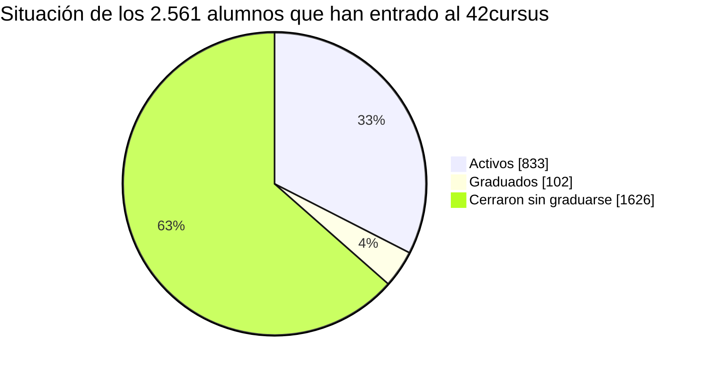

# POC: por qué necesitamos 42 Stats

Prueba de concepto basada en los datos reales del campus 42 Madrid (4 de octubre de 2026). Responde a tres preguntas:

1. ¿Cuánta gente cierra el cursus sin graduarse? (el problema)
2. ¿Cuándo y con qué progreso? (la oportunidad de actuar)
3. ¿Qué hace 42 Stats al respecto y cómo comprobaremos si funciona? (la propuesta y cómo medirla)

> Todas las cifras son **agregadas**: no hay ningún alumno concreto. Salen de la base de datos de la sincronización con la API pública de
> 42, y se pueden regenerar con [`scripts/poc_numbers.py`](../scripts/poc_numbers.py) (ver el final).

## Una aclaración de vocabulario que cambia la lectura

**En 42 no existe la baja voluntaria.** Quien quiere irse simplemente deja de venir y, al agotarse su plazo, lo blackholean. Por eso este documento
**no habla de «bajas»**: habla de **cursus cerrados sin graduarse**, que en la práctica son cierres por blackhole.

Lo que **no** podemos confirmar al 100 % es el motivo exacto de cada cierre: la API devuelve la fecha en que se cerró el cursus y una fecha de blackhole
**orientativa**, pero no dice por qué se cerró. Esa fecha no refleja los plazos por milestone del currículo nuevo ni los freezes. Lo veremos en los datos:
unos cierran en su fecha, otros semanas antes (plazo de milestone) y otros meses después (freeze). Ninguna de las tres cosas es una baja voluntaria.

## Resumen

- De **2.561** alumnos que han entrado alguna vez en el 42cursus, **833 (33 %) siguen activos**, **102 (4 %) se han graduado** (son *alumni*) y
  **1.626 (63 %) cerraron el cursus sin graduarse**. De los 1.728 que ya no están en el programa, **el 94 % salió por cierre y solo el 6 % graduado**.
- En las promociones de 2019 a 2023, que ya han tenido tiempo de resolverse, **el 74 % cerró sin graduarse**, el 18 % sigue activo y el 8 % se graduó.
- Cierran **pronto y con poco progreso**: nivel mediano **1,9** tras **361 días** en el cursus; el **80 %** no pasó del Rank 01. Hay cerca de un año para
  detectar el atasco y ayudar.
- **La fecha oficial de blackhole no sirve para anticiparse.** El 34 % de los cierres ocurre *antes* de esa fecha (casi siempre entre 2 y 11 semanas), el 19 % meses *después*,
  y hay 208 alumnos activos con la fecha ya pasada (mediana: 118 días de retraso) que siguen en el programa.
- Hoy, de los 551 alumnos activos a los que aún les quedan ranks, **282 (51 %) llevan más de 90 días sin validar uno** y **110 (20 %) más de 180**.
- 42 Stats cubre ese hueco con ritmo personal frente a la promoción, señales de atasco, consejos y ayuda entre alumnos. **Lo que no demuestran estos
  datos es que reduzca los cierres**: eso es una hipótesis que hay que medir (ver [Cómo comprobaremos que funciona](#cómo-comprobaremos-que-funciona)).

## 1. El problema: cuánta gente se pierde

### Todos los que han entrado al 42cursus

| Situación del cursus | Alumnos | % |
|---|---:|---:|
| Activos hoy (cursus abierto, sin graduarse) | 833 | 32,5 % |
| Graduados (*alumni*) | 102 | 4,0 % |
| **Cerraron el cursus sin graduarse** | **1.626** | **63,5 %** |
| **Total que han entrado** | **2.561** | 100 % |



#### A quién se cuenta

La base tiene 8.460 cuentas. Los **2.561** de arriba son las que cumplen **las dos** condiciones: ser alumno (`kind = student`) y tener un registro
en el 42cursus. Quedan fuera:

| Cuentas | Número | Qué son |
|---|---:|---|
| Alumnos con registro en el 42cursus | **2.561** | **Los que se cuentan en este documento** |
| Alumnos que solo hicieron la C Piscine | 2.082 | Pasaron por la piscina y no han entrado (todavía) al cursus |
| Alumnos sin ningún intento de proyecto | 111 | Cuentas sin actividad |
| Otros | 52 | Casos sueltos: la mayoría con intentos en el 42cursus pero **sin registro de cursus** en los datos (no se cuentan) |
| Cuentas de staff (`admin`) o externas con registro en el 42cursus | 50 | Se excluyen: figuraban como abiertas o como cerradas sin ser alumnos |
| Cuentas `external` sin registro en el cursus | 3.584 | No son alumnos del campus |

Las piscinas «extra» **no inflan** las cifras: el *Discovery Piscine* y el *Bootcamp Cybersecurity* aparecen en unos 60 alumnos cada uno, y casi todos
tienen también registro en el 42cursus. Los **graduados** (*alumni*) conservan el cursus «abierto» en la API, por eso se separan de los activos: ya no
avanzan ni corre ningún plazo para ellos. Una limitación: esos 52 casos podrían ser alumnos reales del cursus cuyo registro no está en los datos; son un
2 % y no cambian las conclusiones.

### Por promoción (año de la piscina)

| Promoción | Entraron a la piscina | Pasaron al cursus | Activos | Graduados | Cerraron sin graduarse | % que cerró |
|---|---:|---:|---:|---:|---:|---:|
| 2026 | 636 | 189 | 179 | 0 | 10 | 5 % |
| 2025 | 1.106 | 379 | 227 | 0 | 152 | 40 % |
| 2024 | 1.464 | 698 | 192 | 3 | 503 | 72 % |
| 2023 | 839 | 652 | 113 | 18 | 521 | 80 % |
| 2022 | 345 | 290 | 56 | 21 | 213 | 73 % |
| 2021 | 166 | 133 | 29 | 13 | 91 | 68 % |
| 2020 | 79 | 69 | 9 | 9 | 51 | 74 % |
| 2019 | 159 | 148 | 27 | 36 | 85 | 57 % |

Las promociones recientes (2025 y 2026) aún están dentro de plazo: su porcentaje es un punto de partida, no un resultado. En las de **2019 a 2023**,
con 1.292 alumnos en el cursus, **961 (74 %) cerraron sin graduarse, 234 (18 %) siguen activos y 97 (8 %) se graduaron**.

### Cuándo se cierran: por mes de cierre

Cursus cerrados sin graduarse, por mes en que se cerraron (los últimos 23 meses completos):

| Mes | Cierres | Mes | Cierres | Mes | Cierres |
|---|---:|---|---:|---|---:|
| 2024-11 | 29 | 2025-08 | 42 | 2026-05 | 35 |
| 2024-12 | 22 | 2025-09 | 49 | 2026-06 | 27 |
| 2025-01 | 28 | 2025-10 | 35 | 2026-07 | 30 |
| 2025-02 | 44 | 2025-11 | 57 | 2026-08 | 21 |
| 2025-03 | 47 | 2025-12 | 20 | 2026-09 | 21 |
| 2025-04 | 52 | 2026-01 | 34 | | |
| 2025-05 | 125 | 2026-02 | 39 | **Total** | **971** |
| 2025-06 | 57 | 2026-03 | 35 | **Media** | **42 al mes** |
| 2025-07 | 95 | 2026-04 | 27 | | |

Son unos **42 cursus cerrados al mes** de media, con picos en mayo y julio de 2025. Se agrupan por la fecha real de cierre y no por la de blackhole
de la API, precisamente porque esa fecha no es fiable.

### ¿Son todos blackholes? Qué dicen las fechas

Comparando la fecha de cierre con la fecha de blackhole de la API, los 1.626 cierres se reparten así:

| Relación con la fecha de la API | Alumnos | % | Cierre respecto a esa fecha (p10 · mediana · p90) |
|---|---:|---:|---|
| **En su fecha** (entre 1 día antes y 60 después) | 768 | 47 % | de 0,8 a 58 días después, mediana **+1 día** |
| **Antes de su fecha** | 553 | 34 % | de 78 a 16 días antes, mediana **32 días antes** |
| **Mucho después de su fecha** (más de 60 días) | 305 | 19 % | de 78 a 248 días después, mediana **112 días después** |

**Lectura.** Si hubiera bajas voluntarias, los cierres anteriores a la fecha se repartirían al azar. Se concentran en una franja estrecha, de 2 a 11 semanas
antes, que es lo que cabe esperar de una regla (el plazo de un milestone que la API no refleja) y no de decisiones personales. Los cierres posteriores son
alumnos que siguieron meses más allá de su fecha (un freeze la alarga y la API no lo anota) y acabaron igualmente cerrados. Por eso lo robusto es la
cifra total (**1.626**) y no la separación entre las tres etiquetas, que solo describe la relación con una fecha poco fiable.

## 2. La oportunidad: se pierden pronto y tarde en detectarse

### Con qué progreso cierran

| | Todos (1.626) | En su fecha (768) | Antes (553) | Después (305) |
|---|---:|---:|---:|---:|
| Mediana de días en el cursus | **361** | 392 | 209 | 788 |
| Nivel mediano al cerrar | **1,9** | 1,4 | 1,2 | 3,3 |
| Cerraron con nivel menor que 3 | 73 % | 79 % | 87 % | 34 % |
| Cerraron con nivel menor que 5 | 96 % | 97 % | 99,6 % | 84 % |
| No validaron ningún Common Core Rank | 21 % | 28 % | 23 % | 0 % |
| No pasaron del Rank 01 | **80 %** | 84 % | 94 % | 43 % |

Último rank validado antes de cerrar (todos):

| Ninguno | Rank 00 | Rank 01 | Rank 02 | Rank 03 | Rank 04 | Rank 05 |
|---:|---:|---:|---:|---:|---:|---:|
| 340 | 481 | 477 | 176 | 90 | 56 | 6 |

**Lectura.** La mayoría cierra el cursus **en el primer tramo**, tras casi un año con un nivel bajo (mediana 361 días, nivel 1,9). Es una ventana larga en la que
un aviso, una comparación con su promoción o una mano de alguien que ya pasó el proyecto pueden cambiar algo. Quienes cierran **meses después** de su fecha (los
que pasaron por un freeze) son otro perfil: llegaron más lejos (nivel 3,3, más de dos años de media) y todos validaron algún rank.

### Cuánto tardan los que sí avanzan

Mediana de días entre milestones, con todos los alumnos que validaron ambos:

| Tramo | Mediana (días) | Alumnos |
|---|---:|---:|
| Inicio → Rank 00 | 31 | 2.112 |
| Rank 00 → Rank 01 | 68 | 1.584 |
| Rank 01 → Rank 02 | 134 | 1.040 |
| Rank 02 → Rank 03 | 153 | 769 |
| Rank 03 → Rank 04 | 153 | 611 |
| Rank 04 → Rank 05 | 222 | 379 |

Cada tramo se alarga, así que **«llevo 100 días sin validar» significa cosas distintas en el Rank 00 que en el Rank 04**. Un aviso útil tiene
que compararse con el ritmo de la promoción para ese tramo, no con una cifra fija. Es lo que calcula el panel personal.

### Cuántos están hoy en esa situación

De los **833** alumnos activos, 282 (34 %) ya tienen los seis ranks validados y 106 no han validado ninguno. Quedan **551** con algo por validar:

| Días desde el último rank validado | Alumnos | % de los 551 |
|---|---:|---:|
| Menos de 30 | 157 | 28 % |
| 30 a 90 | 112 | 20 % |
| 90 a 180 | 172 | 31 % |
| 180 a 365 | 89 | 16 % |
| Más de 365 | 21 | 4 % |

**282 (51 %)** llevan más de 90 días y **110 (20 %)** más de 180. No todos están en riesgo (los tramos tardíos duran más), pero es la
población en la que mirar primero. Además, **45** alumnos activos tienen la fecha de blackhole de la API en menos de 30 días y **208** la tienen ya pasada
sin que su cursus esté cerrado: la fecha oficial **no sirve** para saber quién necesita ayuda.

## 3. La propuesta: qué hace 42 Stats con esto

| Hallazgo | Qué falta hoy | Qué aporta 42 Stats |
|---|---|---|
| Casi un año de nivel bajo antes de cerrar el cursus | Nadie le dice al alumno cómo va respecto a los demás | **Mi panel**: ritmo frente a su promoción, rank y milestones, señales de atasco y consejos por reglas |
| La fecha oficial de blackhole no es fiable (cierres 2 a 11 semanas antes, o meses después) | El alumno no ve su margen real; el deadline y el freeze no están en la API pública | El alumno indica su **deadline y su freeze a mano**, y el análisis los usa; el blackhole de la API se muestra solo como orientativo |
| El 80 % no pasa del Rank 01 | Los que ya pasaron cada proyecto no tienen un canal ordenado para ayudar | **Ayuda entre alumnos**: recursos revisados, mentores que validaron cada proyecto, peticiones, «Quiero ayudar» y puntos verificados |
| Los cierres se deciden sin ver el panorama del campus | Ni alumnos ni staff ven dónde se atascan las promociones | **Estadísticas del campus**: cierres por promoción y por mes, tiempo entre milestones, proyectos que se atascan, asistencia |

Hay quien puede ayudar: 282 alumnos activos ya tienen los seis ranks validados y 102 se han graduado, y la mayoría de los 833 ha pasado ya el primer tramo
(solo 106 no han validado ningún rank). Falta el canal ordenado, no la gente.

### Viabilidad técnica (ya demostrada)

- **Datos:** sincronización diaria con la API pública de 42 (límite de 2 peticiones por segundo y 1.200 por hora): 4.806 alumnos,
  114.547 intentos de proyecto, evaluaciones, eventos, exámenes, milestones y unas 750.000 sesiones de ordenador.
- **Producto en marcha:** web con login de 42 desplegada, con panel personal, ayuda entre alumnos, avisos por correo opcionales y
  estadísticas del campus. Detalle en el [README](../README.md).
- **Coste:** una VM que ya existía, el plan gratuito de Brevo (300 correos al día) y el dominio. Sin servicios de pago.
- **Privacidad:** solo permiso `public` de la API, sin guardar el token ni el correo salvo opt-in, datos individuales visibles solo para el
  propio alumno y agregados para el resto, borrado de datos a petición.

## Cómo comprobaremos que funciona

**Hoy no sabemos si 42 Stats reduce los cierres.** Estos datos describen el problema; no miden el efecto de la herramienta (la web lleva
días en uso: 3 alumnos habían iniciado sesión cuando se escribió este documento). Para saberlo proponemos medir, mes a mes:

| Qué | Cómo se mide | Qué esperaríamos si ayuda |
|---|---|---|
| **Adopción** | Alumnos distintos con sesión (registro de accesos), sobre los 833 activos | Crece y se mantiene; no un pico el primer día |
| **Atascos** | % de alumnos con ranks pendientes y más de 180 días sin validar (20 % hoy) | Baja entre quienes usan la web |
| **Ritmo** | Mediana de días entre milestones, comparando usuarios y no usuarios | Más corta entre usuarios |
| **Ayuda** | Peticiones abiertas, tiempo hasta el primer «Quiero ayudar», puntos verificados | Respuesta en horas o pocos días; mentores nuevos cada mes |
| **Cierres** | % de una promoción que cierra el cursus sin graduarse a los 12 meses, para promociones con acceso a la web frente a las que no lo tuvieron | Menor en las que la usaron |

**Cautelas.** Quien usa la web probablemente ya está más motivado (sesgo de selección), por lo que una diferencia entre usuarios y no usuarios
no prueba por sí sola que la herramienta funcione. La comparación más fiable es la de promociones con y sin acceso, y aun así no controla otros
cambios del campus. Para los plazos reales de cada milestone y para conocer el motivo exacto de cada cierre haría falta que el staff comparta los datos
que la API pública no expone.

## Cómo se ha medido y qué no dicen los datos

- **Fuente:** API pública de 42 sincronizada a la base local; datos del campus 22 (Madrid) y del 42cursus (id 21). Cifras del 4 de octubre de 2026.
- **Alumno:** cuenta con `kind = student` y registro en el 42cursus; se excluyen las cuentas de staff y las externas.
- **Activo:** cursus abierto (sin fecha de cierre o con cierre futuro) y no graduado. **Graduado:** marcado como *alumni* por la API.
- **Cerró sin graduarse:** cursus cerrado y no alumni. Como en 42 no hay baja voluntaria, es en la práctica un cierre por blackhole, pero **el motivo exacto no
  está confirmado**: la API no lo indica.
- **Relación con la fecha de la API:** «en su fecha» = cierre entre 1 día antes y 60 después de `blackholed_at`; «antes» = más de 1 día antes; «después» = más de
  60 días después o sin fecha (1 caso). Describe la fecha, **no la causa**.
- **Las promociones recientes** no han tenido tiempo de resolverse: no se comparan con las antiguas.
- **«Último rank validado»** sale de los *Common Core Rank* del 42cursus; los alumnos con los seis validados quedan fuera del cómputo de atascos.
- **No hay causalidad:** describir cuándo y con qué progreso se cierra no explica por qué.
- **No hay datos individuales:** el script solo imprime recuentos y medianas; el repositorio no contiene personas.

## Reproducir las cifras

```bash
# contra la base de la VM (conexión de solo lectura):
docker run --rm -i -v stats42_stats42_data:/data --entrypoint python stats42:latest - < scripts/poc_numbers.py
```

Imprime un JSON con todo lo de este documento. Para repetirlo en otra fecha basta con volver a ejecutarlo y actualizar las tablas.
(La imagen de la VM debe tener la versión del código que separa graduados y excluye al staff; si no, monta `src/stats42/stats.py` sobre ella.)
