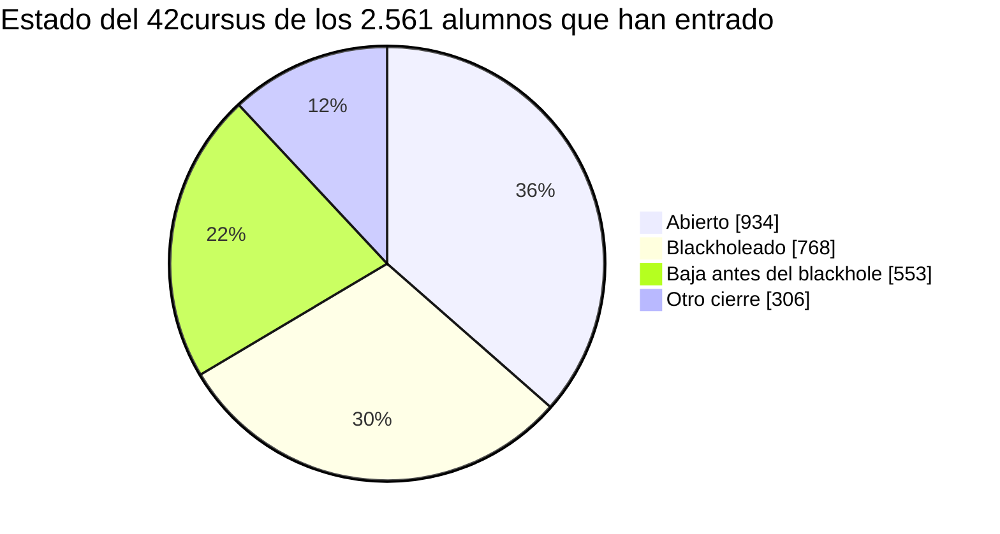

# POC: por qué necesitamos 42 Stats

Prueba de concepto basada en los datos reales del campus 42 Madrid (4 de octubre de 2026). Responde a tres preguntas:

1. ¿Cuánta gente abandona o termina blackholeada? (el problema)
2. ¿Cuándo y con qué progreso? (la oportunidad de actuar)
3. ¿Qué hace 42 Stats al respecto y cómo comprobaremos si funciona? (la propuesta y cómo medirla)

> Todas las cifras son **agregadas**: no hay ningún alumno concreto. Salen de la base de datos de la sincronización con la API pública de
> 42, y se pueden regenerar con [`scripts/poc_numbers.py`](../scripts/poc_numbers.py) (ver el final). Las definiciones y sus límites están
> en el apartado [Cómo se ha medido](#cómo-se-ha-medido-y-qué-no-dicen-los-datos).

## Resumen

- De **2.561** alumnos que han entrado alguna vez en el 42cursus, solo **934 (36 %)** lo tienen abierto hoy. **1.321 (52 %)** lo cerraron por
  blackhole (768) o por baja antes de su fecha de blackhole (553). Otros 306 (12 %) lo cerraron de otra forma. Solo se cuentan **alumnos
  del 42cursus**: ni las cuentas de staff ni quien solo hizo una piscina (ver [a quién se cuenta](#a-quién-se-cuenta)).
- En las promociones de 2019 a 2023, que ya han tenido tiempo de resolverse, **solo el 26 % de quienes entraron al cursus sigue abierto**:
  tres de cada cuatro ya no están.
- **Se quedan atascados al principio y durante mucho tiempo.** Los blackholeados cierran con un nivel mediano de **1,4** tras una mediana de
  **392 días** (13 meses) en el cursus; el **84 %** no pasó del Rank 01. Hay más de un año para detectar el atasco y ayudar.
- **La fecha oficial de blackhole no sirve para anticiparse.** En el currículo nuevo los plazos van por milestone y la API no los expone:
  208 alumnos con el cursus abierto tienen una fecha de blackhole ya pasada, y el alumno no ve cuánto margen real le queda.
- Hoy, de los 559 alumnos con el cursus abierto a los que aún les quedan ranks, **290 (52 %) llevan más de 90 días sin validar uno** y
  **118 (21 %) más de 180**.
- 42 Stats cubre ese hueco con ritmo personal frente a la promoción, señales de atasco, consejos y ayuda entre alumnos. **Lo que no
  demuestran estos datos es que reduzca el abandono**: eso es una hipótesis que hay que medir (ver [Cómo comprobaremos que funciona](#cómo-comprobaremos-que-funciona)).

## 1. El problema: cuánta gente se pierde

### Todos los que han entrado al 42cursus

| Situación del cursus | Alumnos | % |
|---|---:|---:|
| Abierto hoy | 934 | 36,5 % |
| Cerrado por blackhole | 768 | 30,0 % |
| Cerrado por baja antes del blackhole | 553 | 21,6 % |
| Cerrado de otra forma | 306 | 11,9 % |
| **Total que han entrado** | **2.561** | 100 % |



De los 1.627 cursus ya cerrados, **el 81 % terminó en blackhole o baja**.

#### A quién se cuenta

La base tiene 8.460 cuentas. Los **2.561** de arriba son las que cumplen **las dos** condiciones: ser alumno (`kind = student`) y tener un registro
en el 42cursus. Quedan fuera:

| Cuentas | Número | Qué son |
|---|---:|---|
| Alumnos con registro en el 42cursus | **2.561** | **Los que se cuentan en este documento** |
| Alumnos que solo hicieron la C Piscine | 2.082 | Pasaron por la piscina y no han entrado (todavía) al cursus |
| Alumnos sin ningún intento de proyecto | 111 | Cuentas sin actividad |
| Otros | 52 | Casos sueltos: la mayoría con intentos en el 42cursus pero **sin registro de cursus** en los datos (no se cuentan), y algunos con intentos solo en cursus antiguos |
| Cuentas de staff (`admin`) o externas con registro en el 42cursus | 50 | Se excluyen: 26 figuraban como «abiertas» y 24 como «otro cierre»; **ninguna** como blackholeada ni de baja |
| Cuentas `external` sin registro en el cursus | 3.584 | No son alumnos del campus |

Las piscinas «extra» **no inflan** las cifras: el *Discovery Piscine* y el *Bootcamp Cybersecurity* aparecen en unos 60 alumnos cada uno, y casi todos
tienen también registro en el 42cursus (los pocos que no, menos de diez, están entre los 52 «otros» que no se cuentan). La C Piscine es la puerta de entrada
normal, y por eso la columna «Entraron a la piscina» de la tabla de promociones cuenta alumnos que pasaron por ella, no solo los que llegaron al cursus.
Una limitación: esos 52 casos podrían ser alumnos reales del cursus cuyo registro no está en los datos; son un 2 % y no cambian las conclusiones.

### Por promoción (año de la piscina)

| Promoción | Entraron a la piscina | Pasaron al cursus | Siguen abiertos | Blackholeados | Baja antes | Siguen / pasaron |
|---|---:|---:|---:|---:|---:|---:|
| 2026 | 636 | 189 | 179 | 1 | 9 | 94,7 % |
| 2025 | 1.106 | 379 | 227 | 9 | 143 | 59,9 % |
| 2024 | 1.464 | 698 | 195 | 115 | 338 | 27,9 % |
| 2023 | 839 | 652 | 131 | 355 | 14 | 20,1 % |
| 2022 | 345 | 290 | 77 | 139 | 8 | 26,6 % |
| 2021 | 166 | 133 | 42 | 53 | 13 | 31,6 % |
| 2020 | 79 | 69 | 17 | 35 | 10 | 24,6 % |
| 2019 | 159 | 148 | 63 | 61 | 18 | 42,6 % |

Las promociones recientes (2025 y 2026) aún están dentro de plazo: su retención se parece más a un punto de partida que a un resultado.
Las de **2019 a 2023** ya han tenido tiempo: entraron 1.292 al cursus, **330 siguen abiertos (26 %)**, 706 (55 %) terminaron en blackhole o
baja y 256 (20 %) cerraron de otra forma.

### Ritmo de blackholeados en los últimos 24 meses

Según la fecha de blackhole que devuelve la API (que es orientativa, ver las limitaciones):

| Mes | Alumnos | Mes | Alumnos | Mes | Alumnos |
|---|---:|---|---:|---|---:|
| 2024-11 | 29 | 2025-07 | 3 | 2026-03 | 5 |
| 2024-12 | 36 | 2025-08 | 3 | 2026-04 | 5 |
| 2025-01 | 15 | 2025-09 | 2 | 2026-05 | 6 |
| 2025-02 | 10 | 2025-10 | 4 | 2026-06 | 1 |
| 2025-03 | 38 | 2025-11 | 4 | 2026-07 | 4 |
| 2025-04 | 11 | 2025-12 | 8 | 2026-08 | 7 |
| 2025-05 | 9 | 2026-01 | 7 | 2026-09 | 0 |
| 2025-06 | 10 | 2026-02 | 4 | **Total** | **221** |

El pico de noviembre de 2024 a marzo de 2025 (128 alumnos en cinco meses) podría corresponder a la promoción de 2023, que acumula 355
blackholeados (es una hipótesis: los datos no dicen en qué momento concreto de cada promoción ocurre). La caída posterior
**no se debe interpretar como que mejora la situación**: en el currículo nuevo el blackhole depende de los plazos de cada milestone y la
fecha de la API ya no lo refleja (hay 208 alumnos con el cursus abierto y una fecha ya pasada que no cuentan aquí).

## 2. La oportunidad: se pierden pronto y tarde en detectarse

### Con qué progreso cierran

| | Blackholeados (768) | Baja antes (553) |
|---|---:|---:|
| Mediana de días en el cursus antes de cerrar | **392** | **209** |
| Nivel mediano al cerrar | 1,4 | 1,2 |
| Cerraron con nivel menor que 3 | 79 % | 87 % |
| Cerraron con nivel menor que 5 | 97 % | 99,6 % |
| No validaron ningún Common Core Rank | 28 % | 23 % |
| No pasaron del Rank 01 | **84 %** | **94 %** |

Último rank validado antes de cerrar:

| | Ninguno | Rank 00 | Rank 01 | Rank 02 | Rank 03 | Rank 04 | Rank 05 |
|---|---:|---:|---:|---:|---:|---:|---:|
| Blackholeados | 215 | 298 | 135 | 73 | 30 | 16 | 1 |
| Baja antes | 125 | 182 | 213 | 28 | 4 | 1 | 0 |

**Lectura.** Quien termina blackholeado pasa **más de un año en el cursus sin salir del primer tramo** (nivel mediano 1,4). Es una ventana
larga durante la que un aviso, una comparación con su promoción o una mano de alguien que ya pasó el proyecto pueden cambiar algo. Quien se da
de baja lo hace antes (unos siete meses), también con poco avance.

### Cuánto tardan los que sí avanzan

Mediana de días entre milestones, con todos los alumnos que validaron ambos:

| Tramo | Mediana (días) | Alumnos |
|---|---:|---:|
| Inicio → Rank 00 | 31 | 2.112 |
| Rank 00 → Rank 01 | 68 | 1.584 |
| Rank 01 → Rank 02 | 134 | 1.040 |
| Rank 02 → Rank 03 | 153 | 769 |
| Rank 03 → Rank 04 | 153 | 611 |
| Rank 04 → Rank 05 | 222 | 379 |

Cada tramo se alarga, así que **«llevo 100 días sin validar» significa cosas distintas en el Rank 00 que en el Rank 04**. Un aviso útil tiene
que compararse con el ritmo de la promoción para ese tramo, no con una cifra fija. Es lo que calcula el panel personal.

### Cuántos están hoy en esa situación

De los **934** alumnos con el cursus abierto, 375 (40 %) ya tienen los seis ranks validados. Quedan **559** con algo por validar:

| Días desde el último rank validado | Alumnos | % de los 559 |
|---|---:|---:|
| Menos de 30 | 157 | 28 % |
| 30 a 90 | 112 | 20 % |
| 90 a 180 | 172 | 31 % |
| 180 a 365 | 89 | 16 % |
| Más de 365 | 29 | 5 % |

**290 (52 %)** llevan más de 90 días y **118 (21 %)** más de 180. No todos están en riesgo (los tramos tardíos duran más), pero es la
población en la que mirar primero. Además, **45** alumnos tienen la fecha de blackhole de la API en menos de 30 días y **208** la tienen ya pasada
sin estar blackholeados: la fecha oficial **no sirve** para saber quién necesita ayuda.

## 3. La propuesta: qué hace 42 Stats con esto

| Hallazgo | Qué falta hoy | Qué aporta 42 Stats |
|---|---|---|
| Más de un año de atasco antes del blackhole | Nadie le dice al alumno cómo va respecto a los demás | **Mi panel**: ritmo frente a su promoción, rank y milestones, señales de atasco y consejos por reglas |
| La fecha oficial de blackhole no es fiable | El alumno no ve su margen real; el deadline y el freeze no están en la API pública | El alumno indica su **deadline y su freeze a mano**, y el análisis los usa; el blackhole de la API se muestra solo como orientativo |
| El 84 % no pasa del Rank 01 | Los que ya pasaron cada proyecto no tienen un canal ordenado para ayudar | **Ayuda entre alumnos**: recursos revisados, mentores que validaron cada proyecto, peticiones, «Quiero ayudar» y puntos verificados |
| El cierre se decide sin ver el panorama del campus | Ni alumnos ni staff ven dónde se atascan las promociones | **Estadísticas del campus**: retención por promoción, tiempo entre milestones, proyectos que se atascan, asistencia |

Hay quien puede ayudar: 375 alumnos con el cursus abierto ya tienen los seis ranks validados, y la mayoría de los 934 ha pasado ya el primer tramo
(solo 109 no han validado ningún rank). Falta el canal ordenado, no la gente.

### Viabilidad técnica (ya demostrada)

- **Datos:** sincronización diaria con la API pública de 42 (límite de 2 peticiones por segundo y 1.200 por hora): 4.806 alumnos,
  114.547 intentos de proyecto, evaluaciones, eventos, exámenes, milestones y unas 750.000 sesiones de ordenador.
- **Producto en marcha:** web con login de 42 desplegada, con panel personal, ayuda entre alumnos, avisos por correo opcionales y
  estadísticas del campus. Detalle en el [README](../README.md).
- **Coste:** una VM que ya existía, el plan gratuito de Brevo (300 correos al día) y el dominio. Sin servicios de pago.
- **Privacidad:** solo permiso `public` de la API, sin guardar el token ni el correo salvo opt-in, datos individuales visibles solo para el
  propio alumno y agregados para el resto, borrado de datos a petición.

## Cómo comprobaremos que funciona

**Hoy no sabemos si 42 Stats reduce el abandono.** Estos datos describen el problema; no miden el efecto de la herramienta (la web lleva
días en uso: 3 alumnos han iniciado sesión desde que existe el registro de accesos). Para saberlo proponemos medir, mes a mes:

| Qué | Cómo se mide | Qué esperaríamos si ayuda |
|---|---|---|
| **Adopción** | Alumnos distintos con sesión (registro de accesos), sobre los 934 con el cursus abierto | Crece y se mantiene; no un pico el primer día |
| **Atascos** | % de alumnos con ranks pendientes y más de 180 días sin validar (21 % hoy) | Baja entre quienes usan la web |
| **Ritmo** | Mediana de días entre milestones, comparando usuarios y no usuarios | Más corta entre usuarios |
| **Ayuda** | Peticiones abiertas, tiempo hasta el primer «Quiero ayudar», puntos verificados | Respuesta en horas o pocos días; mentores nuevos cada mes |
| **Retención** | % de una promoción con el cursus abierto a los 12 meses, para promociones con acceso a la web frente a las que no lo tuvieron | Mayor en las que la usaron |

**Cautelas.** Quien usa la web probablemente ya está más motivado (sesgo de selección), por lo que una diferencia entre usuarios y no usuarios
no prueba por sí sola que la herramienta funcione. La comparación más fiable es la de promociones con y sin acceso, y aun así no controla otros
cambios del campus. Para los plazos reales de cada milestone y para distinguir baja voluntaria de blackhole por plazo haría falta que el staff
comparta los datos que la API pública no expone.

## Cómo se ha medido y qué no dicen los datos

- **Fuente:** API pública de 42 sincronizada a la base local; datos del campus 22 (Madrid) y del 42cursus (id 21). Cifras del 4 de octubre de 2026.
- **«Entraron al cursus»:** alumnos (`kind = student`) con un registro en el 42cursus; se excluyen las cuentas de staff y las externas. **«Abierto»:**
  sin fecha de cierre o con cierre futuro. El cálculo solo sincroniza el 42cursus, así que las piscinas no tienen registro propio: se reconocen por los intentos de proyecto.
- **«Blackholeado»:** cursus cerrado entre un día antes y 60 días después de su `blackholed_at`. **«Baja antes»:** cerrado más de un día antes.
  **«Otro cierre»:** cualquier otro caso (por ejemplo, un cierre mucho después de la fecha de blackhole o sin ella).
- **Se mezclan dos cosas en «baja antes».** Como la fecha de blackhole de la API no refleja los plazos por milestone del currículo nuevo,
  parte de las «bajas» de 2024 y 2025 pueden ser alumnos expulsados por un plazo de milestone anterior a esa fecha. Por eso el dato robusto es
  la **suma blackholeados + bajas (1.321)**, no la separación entre las dos.
- **Las promociones recientes** no han tenido tiempo de resolverse: no se comparan con las antiguas.
- **«Último rank validado»** sale de los *Common Core Rank* del 42cursus; los alumnos con los seis validados quedan fuera del cómputo de atascos.
- **No hay causalidad:** describir cuándo y con qué progreso se van no explica por qué.
- **No hay datos individuales:** el script solo imprime recuentos y medianas; el repositorio no contiene personas.

## Reproducir las cifras

```bash
# contra la base de la VM (conexión de solo lectura):
docker run --rm -i -v stats42_stats42_data:/data --entrypoint python stats42:latest - < scripts/poc_numbers.py
```

Imprime un JSON con todo lo de este documento. Para repetirlo en otra fecha basta con volver a ejecutarlo y actualizar las tablas.
