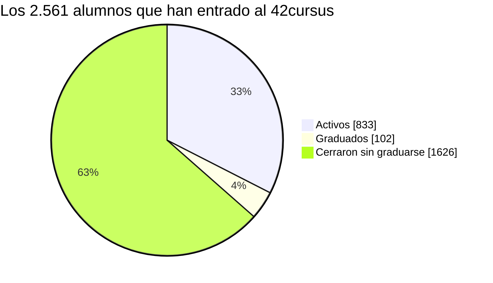

# Por qué hace falta 42 Stats

Datos del campus 42 Madrid a 5 de octubre de 2026. Todas las cifras son agregadas: no aparece ningún alumno concreto. Cómo las he calculado está en el apéndice.

## En resumen

Casi dos de cada tres alumnos que han entrado al 42cursus lo han cerrado sin graduarse, y la mayoría tras casi un año con poco avance. Ese atasco se ve en los datos mucho antes del cierre, pero hoy el alumno no tiene una forma sencilla de verlo ni de encontrar a alguien que ya pasó por ahí. 42 Stats intenta cubrir eso. Si de verdad ayuda es algo que todavía no sé y que propongo medir.

- De los 2.561 alumnos que han entrado alguna vez al 42cursus, 833 siguen activos, 102 se han graduado y 1.626 cerraron el cursus sin graduarse.
- La mitad de quienes cierran llevaban al menos un año en el cursus y no habían superado el nivel 1,9. Ocho de cada diez no pasaron del Rank 01.
- Hoy, 281 de los 550 alumnos activos con ranks por validar llevan más de tres meses sin validar uno.
- La fecha de blackhole que muestra la API no sirve para saber quién necesita ayuda.

## Cómo se sale de 42

En 42 nadie se da de baja. Quien quiere irse deja de venir y, cuando se le acaba el plazo, el cursus se cierra por blackhole. Por eso uso «cursus cerrados sin graduarse» en lugar de «bajas». La API dice cuándo se cerró cada cursus, pero no por qué, así que el motivo de cada caso no lo conozco.

## Cuántos se quedan por el camino

De los 2.561 alumnos que han pasado por el 42cursus, un 33 % sigue con el cursus abierto, un 4 % se ha graduado y un 63 % lo cerró sin graduarse. Si miro solo a los 1.728 que ya no están en el programa, el 94 % salió por cierre y el 6 % por graduación. En los últimos doce meses cerraron 381 alumnos, unos 32 al mes.



Las promociones recientes todavía están a medio camino, así que la comparación útil es la de las que ya han tenido tiempo. En las de 2019 a 2023 entraron al cursus 1.292 alumnos: 961 (74 %) lo cerraron sin graduarse, 234 (18 %) siguen y 97 (8 %) se graduaron.

| Promoción | En el cursus | Cerraron sin graduarse | % que cerró |
|---|---:|---:|---:|
| 2026 | 189 | 10 | 5 % |
| 2025 | 379 | 152 | 40 % |
| 2024 | 698 | 503 | 72 % |
| 2023 | 652 | 521 | 80 % |
| 2022 | 290 | 213 | 73 % |
| 2021 | 133 | 91 | 68 % |
| 2020 | 69 | 51 | 74 % |
| 2019 | 148 | 85 | 57 % |

Cuento como graduados a los 102 alumnos que 42 marca como alumni dentro del 42cursus. Hay otros 15 alumni en la base, pero ninguno tiene registro de cursus en los datos, y quedan fuera. Además, 289 alumnos tienen los seis Common Core Rank validados sin ser alumni, porque graduarse exige completar el resto del cursus. Solo veo a quien devuelve el listado del campus, y no existe una cifra oficial pública con la que comparar.

## Cuándo y con qué progreso

Quien cierra sin graduarse suele estar en los primeros ranks, tras un tiempo largo: la mitad pasó al menos 361 días en el cursus y cerró con nivel 1,9 o menos. El 80 % no pasó del Rank 01 y uno de cada cinco no validó ningún rank. Los datos no dicen qué pasó en cada caso, pero durante casi un año el atasco ya se veía.

Los que sí avanzan tardan cada vez más entre un milestone y el siguiente. Esto es lo que tarda un alumno típico (la mediana de quienes validaron los dos):

| Tramo | Días |
|---|---:|
| Inicio a Rank 00 | 31 |
| Rank 00 a Rank 01 | 68 |
| Rank 01 a Rank 02 | 134 |
| Rank 02 a Rank 03 | 153 |
| Rank 03 a Rank 04 | 153 |
| Rank 04 a Rank 05 | 222 |

Cien días sin validar no significan lo mismo en el Rank 00 que en el Rank 04, así que un aviso con una cifra fija se equivocaría a menudo. Tiene más sentido comparar al alumno con el ritmo de su promoción en ese tramo.

## Cómo están hoy los alumnos activos

De los 833 activos, 283 ya han validado los seis ranks y 104 no han validado ninguno. Los 550 restantes tienen ranks por validar: 281 (51 %) llevan más de 90 días sin validar uno y 109 (20 %) más de 180. No todos están en riesgo, porque los tramos finales duran más, pero ahí miraría primero.

La fecha de blackhole que muestra la API es solo orientativa: no recoge los plazos por milestone del currículo nuevo ni los freezes. Ahora mismo hay 208 alumnos que siguen en el cursus con esa fecha ya pasada, de mediana unos cuatro meses. No me fío de ella para decidir quién necesita ayuda.

## Qué propone 42 Stats

El panel personal enseña a cada alumno cómo va frente a su promoción: nivel, rank, tiempo desde el último milestone y señales de atasco, con consejos sencillos basados en reglas. Como el deadline y el freeze no están en la API pública, el alumno puede indicarlos a mano y el análisis los usa. La fecha de blackhole de la API se muestra solo como referencia.

La ayuda entre alumnos intenta resolver que quien ya pasó un proyecto no tiene un canal ordenado para ayudar a quien se atasca. Hay recursos de estudio que se aprueban a mano antes de publicarse, mentores que han validado cada proyecto según nuestros datos, un sitio para pedir ayuda y puntos de mentoría que solo cuentan cuando el alumno ayudado valida el proyecto. Gente con experiencia hay: 283 alumnos activos han validado los seis ranks y 102 se han graduado.

Las estadísticas del campus, solo con datos agregados y solo para quien ha entrado con su cuenta de 42, enseñan dónde se atascan las promociones: cierres por mes, tiempo entre milestones y proyectos que más cuestan.

La web ya está en marcha. Cada noche se actualiza con la API pública de 42 (114.564 intentos de proyecto, además de evaluaciones y sesiones de ordenador). Corre en una máquina que ya existía, y los avisos por correo, que son opcionales, usan el plan gratuito de Brevo. El [README](../README.md) tiene los detalles técnicos.

## Qué no sé todavía y cómo lo voy a medir

Todavía no sé si 42 Stats ayuda a que menos gente cierre el cursus. La web lleva unos días abierta y nada de lo anterior mide su efecto. Propongo vigilar cuatro cosas:

| Qué | Cómo | Buena señal |
|---|---|---|
| Adopción | Alumnos distintos que entran, sobre los 833 activos | Que crezca y se mantenga después del primer día |
| Atascos | Porcentaje de activos con ranks pendientes que llevan más de 180 días sin validar (hoy, 20 %) | Que baje |
| Ayuda | Tiempo hasta el primer «Quiero ayudar» a una petición | Horas o pocos días, y mentores nuevos cada mes |
| Cierres | Porcentaje de cada promoción que cierra a los 12 meses, con y sin acceso a la web | Menor en las promociones que la usaron |

Quien usa la web probablemente ya está más motivado, así que comparar usuarios con no usuarios no demuestra nada por sí solo. Comparar promociones con y sin acceso es más fiable, pero tampoco aísla otros cambios del campus. Y el motivo real de cada cierre solo lo tiene el staff.

Propongo revisar estas cifras a los 6 y a los 12 meses, y publicar el resultado aunque sea neutro o negativo.

## Privacidad

La web pide solo el permiso `public` de la API y no guarda el token. El correo se guarda únicamente si el alumno activa los avisos. Lo individual solo lo ve el propio alumno, y lo que ve el resto son datos agregados.

# Apéndice: método y cifras completas

## Qué cuento y cómo

- La fuente es la API pública de 42 sincronizada a una base local, con el campus 22 (Madrid) y el 42cursus (id 21). Las cifras son del 5 de octubre de 2026.
- Un alumno es una cuenta de tipo estudiante con registro en el 42cursus. Las cuentas de staff y las externas quedan fuera.
- Un alumno activo tiene el cursus abierto (sin cierre, o con cierre futuro) y no está graduado.
- Un graduado está marcado como alumni por la API. Esas cuentas conservan el cursus abierto, así que se separan de las activas: ya no avanzan ni corre ningún plazo para ellas.
- Cerró sin graduarse quien tiene el cursus cerrado y no es alumni. En la práctica es un cierre por blackhole, pero la API no dice el motivo.
- El último rank validado sale de los Common Core Rank del 42cursus. Los alumnos con los seis validados quedan fuera del cómputo de atascos.
- Los datos describen cuándo y con qué progreso se cierra el cursus. No dicen por qué.
- No hay datos individuales: el script solo imprime recuentos y medianas.

## A quién se cuenta

La base tiene 8.460 cuentas, de las cuales 4.806 son de estudiantes. Se cuentan los 2.561 con registro en el 42cursus. Los otros 2.245 estudiantes no tienen ese registro: casi todos hicieron solo la piscina y no han entrado, todavía, al cursus.

| Cuentas | Número |
|---|---:|
| Con registro en el 42cursus | 2.611 |
| De ellas, de staff o externas (se excluyen) | 50 |
| Alumnos contados | 2.561 |

## Graduados con más detalle

| | Número |
|---|---:|
| Estudiantes marcados como alumni en la base | 117 |
| De ellos, con registro en el 42cursus (los que se cuentan) | 102 |
| Sin ningún registro de cursus en los datos | 15 |
| Alumnos con los seis ranks validados | 383 |
| De ellos, sin ser alumni | 289 |
| Alumni del 42cursus sin los seis ranks | 8 |

De los 15 alumni sin registro de cursus, ocho entraron entre 2014 y 2018 y siete entre 2019 y 2024. No sé por qué esos siete no tienen cursus en los datos.

## Promociones completas

| Promoción | Entraron a la piscina | En el cursus | Activos | Graduados | Cerraron | % que cerró |
|---|---:|---:|---:|---:|---:|---:|
| 2026 | 636 | 189 | 179 | 0 | 10 | 5 % |
| 2025 | 1.106 | 379 | 227 | 0 | 152 | 40 % |
| 2024 | 1.464 | 698 | 192 | 3 | 503 | 72 % |
| 2023 | 839 | 652 | 113 | 18 | 521 | 80 % |
| 2022 | 345 | 290 | 56 | 21 | 213 | 73 % |
| 2021 | 166 | 133 | 29 | 13 | 91 | 68 % |
| 2020 | 79 | 69 | 9 | 9 | 51 | 74 % |
| 2019 | 159 | 148 | 27 | 36 | 85 | 57 % |

Las promociones de 2025 y 2026 aún están dentro de plazo: su porcentaje es un punto de partida, no un resultado.

## Cierres por mes

Cursus cerrados sin graduarse, por mes de cierre. Se agrupan por la fecha real de cierre, no por la de blackhole de la API. El último mes completo es septiembre de 2026.

| Mes | Cierres | Mes | Cierres | Mes | Cierres |
|---|---:|---|---:|---|---:|
| 2024-11 | 29 | 2025-08 | 42 | 2026-05 | 35 |
| 2024-12 | 22 | 2025-09 | 49 | 2026-06 | 27 |
| 2025-01 | 28 | 2025-10 | 35 | 2026-07 | 30 |
| 2025-02 | 44 | 2025-11 | 57 | 2026-08 | 21 |
| 2025-03 | 47 | 2025-12 | 20 | 2026-09 | 21 |
| 2025-04 | 52 | 2026-01 | 34 | | |
| 2025-05 | 125 | 2026-02 | 39 | | |
| 2025-06 | 57 | 2026-03 | 35 | | |
| 2025-07 | 95 | 2026-04 | 27 | | |

Los últimos doce meses completos (octubre de 2025 a septiembre de 2026) suman 381 cierres. Mayo y julio de 2025 destacan por encima del resto y no sé a qué se deben.

## Progreso al cerrar

| | Todos | En su fecha | Antes | Después |
|---|---:|---:|---:|---:|
| Alumnos | 1.626 | 768 | 553 | 305 |
| Mediana de días en el cursus | 361 | 392 | 209 | 788 |
| Nivel mediano al cerrar | 1,9 | 1,4 | 1,2 | 3,3 |
| No pasaron del Rank 01 | 80 % | 84 % | 94 % | 43 % |
| No validaron ningún rank | 21 % | 28 % | 23 % | 0 % |

Último rank validado antes de cerrar, para los 1.626: ninguno, 340; Rank 00, 481; Rank 01, 477; Rank 02, 176; Rank 03, 90; Rank 04, 56; Rank 05, 6. El 73 % cerró con nivel menor que 3 y el 96 % con nivel menor que 5.

## Relación del cierre con la fecha de blackhole de la API

Las tres columnas de la tabla anterior comparan la fecha de cierre con la fecha de blackhole que da la API. «En su fecha» es un cierre entre un día antes y 60 después, «antes» es más de un día antes, y «después» es más de 60 días después (o sin fecha, un caso).

| Relación con la fecha | Alumnos | % | Mediana |
|---|---:|---:|---|
| En su fecha | 768 | 47 % | 1 día después |
| Antes de su fecha | 553 | 34 % | 32 días antes |
| Más de 60 días después | 305 | 19 % | 112 días después |

La tabla solo describe la fecha. Como la API no recoge los plazos por milestone ni los freezes, no puedo decir a qué corresponde cada grupo, y me quedo con la cifra total de cierres en lugar de este reparto. Además, hay 53 alumnos activos con la fecha de blackhole de la API dentro de los próximos 30 días.

## Reproducir las cifras

```bash
# contra la base de la VM, con conexión de solo lectura:
docker compose -f docker-compose.vm.yml exec -T web python - < scripts/poc_numbers.py
```

Imprime un JSON con todas las cifras de este documento, incluidos los recuentos de graduados. Para repetirlo en otra fecha basta con volver a ejecutarlo y actualizar las tablas.
